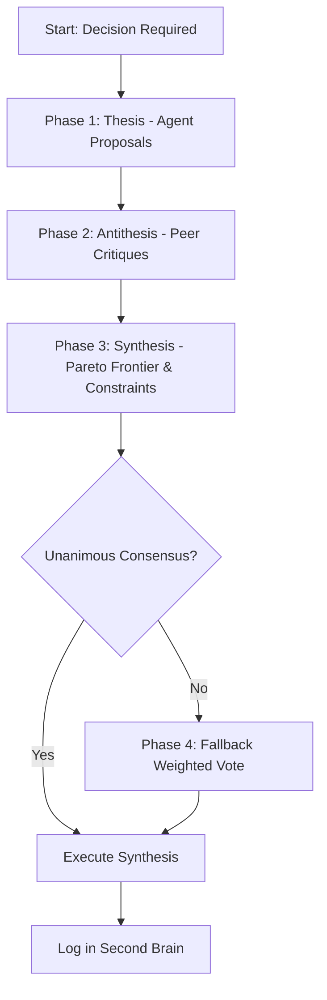

# Skill: Agent Debate Protocol (Supreme Court of Agents)

This protocol defines the standard process for resolving complex architectural, security, or design decisions through structured multi-agent debates. It is styled as the **"Supreme Court of Agents" (SCoA)**.

Rather than relying on simple majoritarian voting or endless talking in circles, it uses a **Deliberatively Guided Weighted Consensus** hybrid system, ensuring high-fidelity engineering decisions.

---

## 1. The Debate Workflow (Thesis-Antithesis-Synthesis)

The SCoA resolves disputes through three structured phases:



### Phase 1: Thesis (Domain Proposal)
1. **Moderator Initiative**: The Main Agent (or user) defines the issue and spawns specialized subagents (e.g. Security, Performance, UI/UX, Dev-Experience).
2. **Domain Draft**: Each agent analyzes the issue and drafts a thesis proposal detailing:
   - *Impact score*: High, Medium, or Low on their domain.
   - *Key Constraints*: Must-have requirements for their domain.
   - *Optimized Design*: Their preferred implementation configuration.

### Phase 2: Antithesis (Structured Cross-Critique)
1. **Peer Review**: Each agent reviews the other agents' theses.
2. **Critique Submission**: Agents submit critiques detailing:
   - *Points of Conflict*: Where another proposal violates their domain's constraints.
   - *Weakness Analysis*: Uncovering hidden assumptions in competing proposals.
3. **Rebuttal / Refinement**: Agents receive critiques and must either adjust their thesis (concede) or write a rebuttal showing why their design remains safe.

### Phase 3: Synthesis (Pareto Frontier & Constraints)
1. **Pareto Frontier Calculation**: The Moderator compiles all proposals and filters out dominated designs. A design is dominated if another design is equal to or better than it in *all* criteria.
2. **Constraint Negotiation**: The Moderator applies hard thresholds (e.g., "Latency must be < 50ms", "Path Traversal Risk must be ZERO").
3. **Synthesis Draft**: If a single design satisfies all constraints, the Moderator drafts it as the consensus design.

### Phase 4: Fallback Weighted Ballot (Casting Vote)
If deliberation hits a dead-end due to conflicting priorities (e.g., security vs. raw speed), the Moderator calls a vote on the Pareto-efficient options:
1. **Weighted Ballot**: Agents cast votes with weights assigned by domain:
   - **General issues**: All agents have weight `1.0`.
   - **Security questions**: Security Agent has weight `2.0`.
   - **Visual/UX questions**: UI/UX Agent has weight `2.0`.
   - **System Performance**: Performance Agent has weight `2.0`.
2. **Concession Logging**: Every vote must include a *concession statement* documenting the accepted drawbacks.
3. **Executive Decision**: The Moderator breaks ties (holding a `1.1` vote weight) and logs the final result.

---

## 2. Agent Role Matrix & Domain Weights

| Subagent Role | Specialty Domain | Multiplier Weight | Core Veto Target |
| :--- | :--- | :--- | :--- |
| **SecurityReviewer** | Data Integrity, XSS, Path Traversal | `2.0` on Security | Traversal paths, Raw HTML injects |
| **PerformanceExpert** | Caching, Memory, Latency | `2.0` on Speed | Disk re-scans, Large asset loads |
| **UIUXDesigner** | Responsive Layouts, Styles, Colors | `2.0` on UI/UX | Plain CSS/HTML, Browser defaults |
| **DeveloperDev** | Integration, Setup, Launch script | `2.0` on DX | Multi-step setups, CDNs |

---

## 3. Template Prompt for Future Debates

To execute this protocol in a future session, use the following template to initialize your subagents:

```
[System Prompt / Message]
You are a member of the Supreme Court of Agents. We are debating: [INSERT ISSUE].
Our available roles are: SecurityReviewer, PerformanceExpert, UIUXDesigner.
Please execute Phase 1 (Thesis): Analyze the issue and write your domain proposal.
Identify:
1. Hard constraints for your domain.
2. Preferred setup configuration.
3. Expected impacts on other domains.
```

---

## 🔗 Conexiones
- [[Welcome Hub]]
- [[Error: Python PATH Execution Bug]]