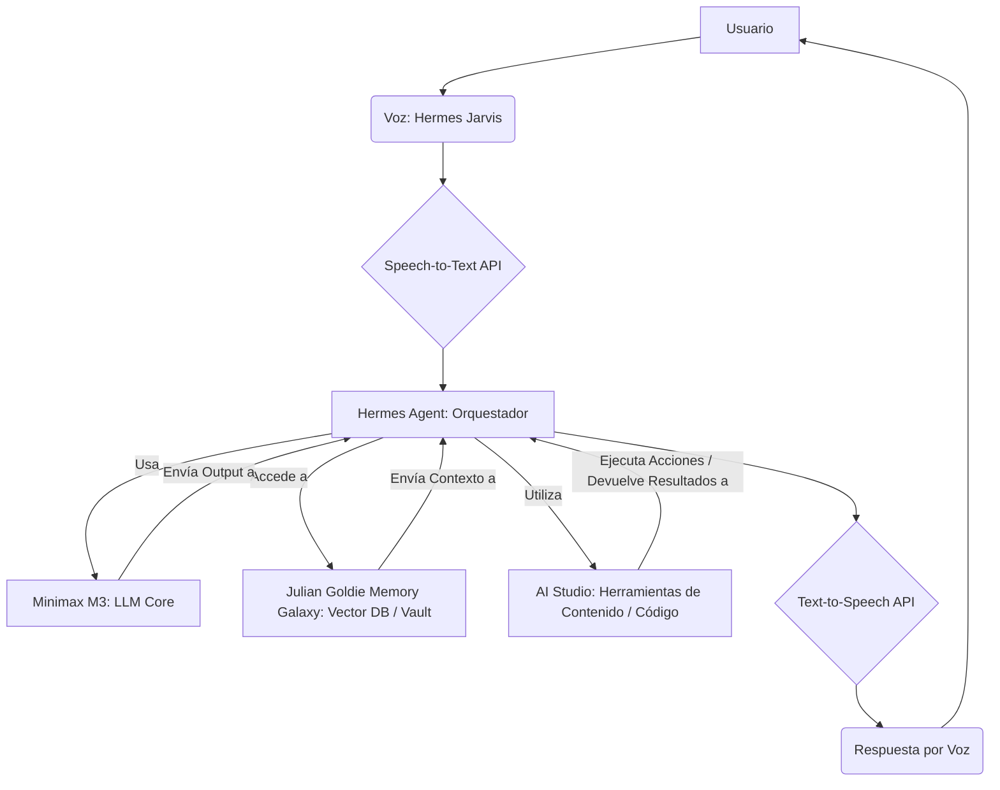

Aquí tienes el análisis técnico solicitado:

---

## Reporte Técnico: Análisis del Video 'Minimax + Hermes Jarvis is Insane'

### 1. Transcripción Literal

00:00: China just changed AI agents forever. So what you can see here is that we have a free setup for Minimax and we can plug it into Hermy's agent. And then we could even plug it into Hermy's Jarvis. And we can voice control our AI agents in one single click. We can plug it into a studio. We could plug it into the Julian Goldie memory Galaxy, like you can see right here. Comment "Agent OS" and I will send you the free guide on how to set this up, my friends.

### 2. Semáforo de Utilidad

*   **Factibilidad Técnica**: ⭐⭐⭐ (La idea es técnicamente posible, pero la implementación "en un clic" y "gratuita" es engañosa).
*   **Complejidad Oculta**: 🔴 (Alta)
*   **Mantenibilidad**: 🔴 (Alta)

### 3. Análisis Hype vs. Realidad

El video presenta una visión ambiciosa y atractiva de un "ecosistema de IA completo" que integra control por voz, automatización, sistemas de memoria y creación de contenido, todo "conectado en un solo lugar" y con una "configuración gratuita". La realidad técnica es mucho más matizada y compleja:

*   **"China just changed AI agents forever"**: Esta es una afirmación grandilocuente para la presentación de un modelo específico (Minimax M3). Si bien China es un actor importante en IA, un solo modelo no "cambia los agentes de IA para siempre" por sí solo. Es un modelo potente, sí, pero el impacto global es una exageración de marketing.
*   **"Free setup for Minimax"**: Si bien Ollama permite ejecutar modelos como Minimax M3 localmente, esto *no es gratuito* en términos de infraestructura. Requiere hardware potente (GPU) y consumo eléctrico. Si se refiere a la API de Minimax (a través de "minimax-m3:cloud" en Ollama, que es una convención para modelos remotos/cloud), entonces cada inferencia tiene un coste por token. La afirmación "gratuita" es, por lo tanto, engañosa.
*   **"Plug it into Hermes Agent... Hermes Jarvis... Studio... Julian Goldie Memory Galaxy"**: El video hace parecer que estas integraciones son sencillas de "enchufar y usar". En realidad, Hermes Agent, Jarvis, Studio y el sistema de memoria ("Memory Galaxy") son probablemente componentes de una arquitectura de agente mucho más compleja, ya sea una plataforma propietaria o un sistema customizado. La integración de estos elementos, especialmente para que funcionen de manera coherente y autónoma, implica una ingeniería considerable, definición de prompts, gestión de estados, y orquestación de herramientas, lejos de ser un "un solo clic".
*   **"Voice control our AI agents in one single click"**: La voz como interfaz requiere al menos dos APIs o servicios (Speech-to-Text y Text-to-Speech) y su integración con el agente. La latencia, precisión del reconocimiento de voz y la naturalidad de la voz generada son desafíos técnicos que no se resuelven con "un solo clic". La robustez de un sistema de control por voz en producción es alta.

En resumen, el video muestra una demo impresionante de lo que *puede ser posible* con una inversión significativa en desarrollo e infraestructura, pero lo empaqueta como una solución sencilla, gratuita y de "un clic", lo cual es un claro 'hype' de captación de leads.

### 4. Puntos Críticos de Falla

1.  **Límites de Contexto y Gestión de Memoria**: Aunque Minimax M3 presume de una ventana de contexto de 512K tokens, la gestión de la "Memory Galaxy" (memoria a largo plazo) es crucial. Las arquitecturas de RAG (Retrieval-Augmented Generation) y los sistemas de re-ranking para insertar información relevante en el contexto del LLM son complejos de implementar de manera efectiva. Un mal manejo de la memoria llevará a que el agente olvide información, alucine o pierda coherencia en tareas de larga duración. Además, la carga de datos del "Memory Galaxy" en el contexto del LLM puede saturar rápidamente la ventana de contexto si no se filtra inteligentemente.
2.  **Orquestación Multi-Agente y Robustez del Agente Maestro**: La interconexión de "Hermes Agent", "Jarvis" y "Studio" implica un agente orquestador principal que delega tareas y gestiona el flujo de trabajo. La robustez de este orquestador es vital. Fallará si no puede manejar excepciones (ej. un sub-agente falla en una tarea), si no puede interpretar correctamente las salidas de otros agentes/herramientas, o si los objetivos se vuelven ambiguos. La "autonomía" es frágil y requiere bucles de feedback, auto-corrección y monitoreo constante para evitar caer en estados irrecuperables.
3.  **Latencia y Coste de Interacción en Tiempo Real**: El control por voz ("Hermes Jarvis") implica una interacción en tiempo real. Esto demanda baja latencia en todos los componentes: reconocimiento de voz, inferencia del LLM (especialmente con una ventana de contexto grande), ejecución de herramientas, recuperación de memoria y síntesis de voz. Un sistema con alta latencia (que es muy probable en un "setup gratuito" o con modelos pesados) será frustrante e inusable en la práctica. Si se usan APIs comerciales para STT/TTS y el LLM, los costes por segundo de interacción pueden escalar rápidamente, haciendo que la promesa de "gratuito" o "barato" sea insostenible.

### 5. Estructura de Costes Ocultos

Asumiendo una implementación robusta para un solo usuario activo durante 8 horas al día, 20 días al mes:

*   **Hardware (si local con Ollama)**:
    *   GPU de gama alta (ej. NVIDIA RTX 4090): $1600 - $2000 (coste inicial, sin amortizar).
    *   Consumo eléctrico: $20 - $50 / mes (dependiendo del uso y coste de electricidad).
*   **Minimax M3 (si API)**:
    *   Estimación de consumo de tokens: Un agente activo puede consumir fácilmente 50k-200k tokens por "vuelta" (prompt + completion), incluyendo memoria y herramientas. Si se realizan ~50 vueltas al día: 2.5M - 10M tokens/día.
    *   Coste por token (estimado, ya que Minimax no publica fácilmente su API price): Asumiendo una tarifa competitiva de $0.001/1k tokens de entrada y $0.003/1k tokens de salida (similar a modelos de OpenAI):
        *   2.5M tokens/día * $0.002 (promedio) / 1k = $5 / día => **$100 / mes**
        *   10M tokens/día * $0.002 (promedio) / 1k = $20 / día => **$400 / mes**
*   **APIs de Voz (STT/TTS)**:
    *   Servicios como Google Cloud Speech-to-Text/Text-to-Speech o OpenAI Whisper/TTS.
    *   Estimación: 8 horas/día * 20 días/mes = 160 horas/mes de audio/texto procesado.
    *   Coste medio: $0.006 - $0.015 por minuto para STT, y $0.006 - $0.016 por cada 1k caracteres para TTS.
    *   160 horas * 60 minutos/hora = 9600 minutos/mes.
    *   Costo de STT: 9600 minutos * $0.01 / minuto (promedio) = $96 / mes.
    *   Costo de TTS: Si se generan ~100k caracteres por hora: 160 horas * 100k caracteres * $0.01 / 1k caracteres = $160 / mes.
    *   Total STT/TTS: **$250 - $300 / mes**.
*   **Plataformas de Agentes / Orquestación (Hermes, Studio, Memory Galaxy)**:
    *   Si son plataformas SaaS: **$100 - $500+ / mes** por usuario/equipo, dependiendo de las características.
    *   Si son soluciones customizadas: Inversión de desarrollo inicial (decenas de miles de dólares) + costes de hosting/servidores **$50 - $200 / mes**.
*   **Almacenamiento de Memoria (Vector DB, etc.)**: **$10 - $50 / mes** (para datos pequeños a medianos).

**Coste mensual total estimado para un solo usuario activo en producción**: **$460 - $1450+ USD/mes** (sin contar la inversión inicial en desarrollo o hardware). La afirmación de "gratuito" es completamente irreal para un uso en producción.

### 6. Diagrama de Bloques Mermaid

### 7. El Poso Útil

El concepto fundamental que se puede rescatar de este video es la **arquitectura modular de un Sistema Operativo de Agentes (Agent OS)**. La idea de un agente central (Hermes Agent) que orquesta diferentes capacidades (control por voz, memoria persistente, ejecución de código/herramientas, generación de contenido) utilizando un Large Language Model (Minimax M3) como "cerebro", es un patrón de ingeniería sólido y muy prometedor para el futuro de las aplicaciones de IA.

Específicamente:
*   **Separación de Preocupaciones**: Dividir el sistema en módulos especializados (STT/TTS, LLM, Memoria, Herramientas) permite una mayor flexibilidad, escalabilidad y mantenibilidad. Se pueden reemplazar componentes individuales (ej. cambiar de LLM o de proveedor de STT/TTS) sin reescribir todo el sistema.
*   **Memoria Externa y RAG**: La inclusión explícita de un sistema de memoria (Julian Goldie Memory Galaxy) subraya la importancia de dotar a los agentes de persistencia y capacidad de recuperar información relevante fuera de la ventana de contexto limitada del LLM. Esto es crucial para tareas complejas y de larga duración.
*   **Interfaces Conversacionales (Voice UI)**: Destaca el valor de la voz como una interfaz natural e intuitiva para interactuar con sistemas de IA, impulsando la adopción y accesibilidad.

Si se aborda con una perspectiva realista de la complejidad, costes y requisitos de infraestructura, esta arquitectura es una dirección válida y poderosa para construir aplicaciones de IA inteligentes.

---